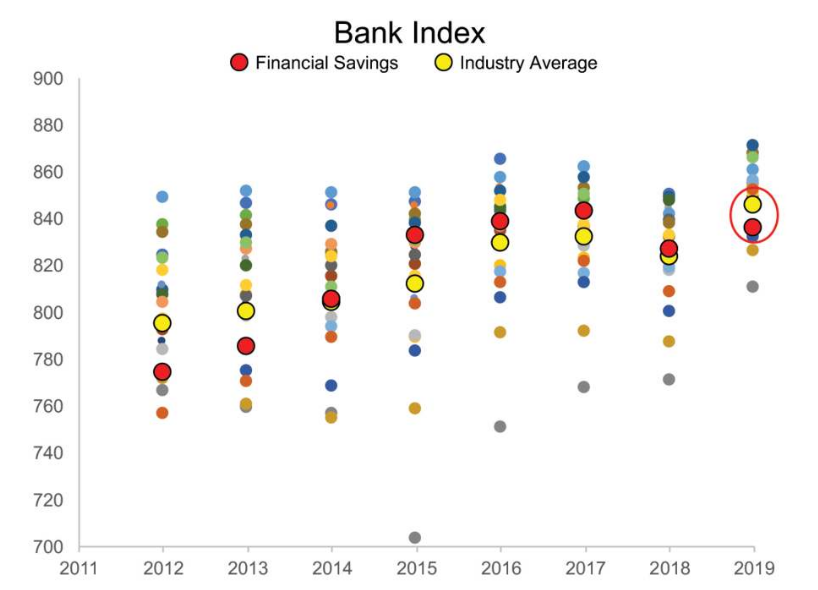

```{r setup, include=FALSE}
knitr::opts_chunk$set(echo = TRUE, message = F, warning = F, 
                      fig.align = "center")
# libraries
if (require(pacman) == FALSE) {
  install.packages("pacman")
}
pacman::p_load(tidyverse, scales, lubridate, readxl, magrittr, dplyr,
               kableExtra, knitr, formattable, gridExtra, grid)
```

## CHAPTER 2

### EXERCISE 1 Improve this table

```{r}
ex_1 <- read_excel("../data/storytelling_practice/chapter_2/2.1 EXERCISE.xlsx",
                   col_types = c(
                     "text", "numeric", "numeric","numeric", "numeric"
                     )
                   )

# save and rds file
write_rds(ex_1, "2_1_EX.rds")

# plot the table
kable(ex_1 %>% 
        mutate(
          `% Accounts` = percent(`% Accounts`),
          `Revenue ($M)` = dollar(`Revenue ($M)`),
          `% Revenue` = percent(`% Revenue`)
          )
      ) %>% 
  kable_styling(bootstrap_options = c("responsive","striped"), 
                full_width = F)
```

Add extra information into the table: 

```{r}
# Find out the actual information
rest <- ex_1 %>%
  summarise_if(is.numeric, sum) %>%
  mutate(Tier = "Rest") %>% 
  select(Tier, everything()) %>% 
  bind_rows(ex_1) %>% 
  filter(Tier == "Rest")

# Create the other missing data 
Other <- tibble(
  Tier = "Other",
  `# of Accounts` = (rest[[2]]*(1 - rest[[3]]))/rest[[3]],
  `% Accounts` = 1 - rest[[3]],
  `Revenue ($M)` = (rest[[4]]*(1 - rest[[5]]))/rest[[5]],
  `% Revenue` = 1 - rest[[5]]
)

# bind the information to add the total 
final_table <- ex_1 %>% 
  bind_rows(Other) %>%
  summarise_if(is.numeric, sum) %>% 
  mutate(Tier = "Total") %>% 
  select(Tier, everything()) %>% 
  bind_rows(ex_1 %>% 
              bind_rows(Other)) %>% 
  mutate(
    Tier = factor(Tier, levels = c("A+","A", "B", "C", "D", "Other", "Total"))
    ) %>% 
  arrange(Tier)
```

Create an HTML table:

```{r}
final_table %>%
  mutate(
    `% Accounts` = percent(`% Accounts`, digits = 0),
    `Revenue ($M)` = dollar(`Revenue ($M)`),
    `% Revenue` = percent(`% Revenue`, digits = 0)
    ) %>% 
  kable(
    col.names = c("Tier","#", "% OF TOT", "$M", "% OF TOT"), align = "c"
    ) %>% 
  column_spec(5, width = "3cm") %>% 
  column_spec(
    3, border_right = T, extra_css = "border-right: 2px solid;"
    ) %>%
  pack_rows(
    start_row = 7, end_row = 7, hline_before = T, 
    label_row_css = "border-bottom: 2px solid;line-height: 0;padding: 0;"
    ) %>% 
  row_spec(0, bold = T, color = "black", background = "ghostwhite", 
           extra_css = "border-bottom: 2px solid #777777;") %>% 
  column_spec(1, bold = T, color = "black", background = "ghostwhite", 
              extra_css = "border-right: 2px solid #777777;") %>% 
  add_header_above(header = c(" " = 1, "Accounts" = 2, "Revenue" = 2), 
                   bold = T, color = "black", background = "ghostwhite", 
                   extra_css = "border-left: 2px solid #777777;") %>% 
  kable_styling(bootstrap_options = c("responsive", "bordered"), 
                full_width = F)
```


Create the pie chart similar to this one: 


```{r}
# add other in the data
all_ex_1 <- ex_1 %>% 
  bind_rows(Other) %>% 
  mutate(
    Tier = factor(Tier, levels = c("Other","D","C", "B", "A","A+"))
    ) 

# plot the pie chart Accounts
pie_accounts <- all_ex_1 %>% 
  ggplot(aes(x = "", y = `% Accounts`, fill = Tier)) +
    geom_col(stat = "identity", width = 1) +
    # Convert to pie (polar coordinates) and add labels
    coord_polar("y", start = 0) + 
    geom_text(
      aes(
        label = Tier#percent(`% Accounts`, digits = 0)
        ), 
      position = position_stack(vjust = 0.7), 
      color = "white", cex = 4.25
      ) + 
    # Add color scale (hex colors)
    scale_fill_manual(
      values=c("#55DDE0", "#33658A", "#2F4858", "#F6AE2D", "#F26419", "#999999")
      ) +
    # Remove labels and add title
    labs(x = NULL, y = NULL, fill = NULL, title = "% Total of Accounts") + 
    # Tidy up the theme
    theme_classic() + 
    theme(axis.line = element_blank(),
          axis.text = element_blank(),
          axis.ticks = element_blank(),
          plot.title = element_text(hjust = 0.5, color = "#666666"), 
          legend.position = "none")

# plot the pie chart Accounts
pie_revenue <- all_ex_1 %>% 
  ggplot(aes(x = "", y = `% Revenue`, fill = Tier)) +
    geom_col(stat = "identity", width = 1) +
    # Convert to pie (polar coordinates) and add labels
    coord_polar("y", start = 0) + 
    geom_text(
      aes(label = Tier), 
      position = position_stack(vjust = 0.7), 
      color = "white", cex = 4.25
      ) + 
    # Add color scale (hex colors)
    scale_fill_manual(
      values=c("#55DDE0", "#33658A", "#2F4858", "#F6AE2D", "#F26419", "#999999")
      ) +
    # Remove labels and add title
    labs(x = NULL, y = NULL, fill = NULL, title = "% Total of Revenue") + 
    # Tidy up the theme
    theme_classic() + 
    theme(axis.line = element_blank(),
          axis.text = element_blank(),
          axis.ticks = element_blank(),
          plot.title = element_text(hjust = 0.5, color = "#666666"), 
          legend.position = "none")

# grid the plots 
grid.arrange(pie_accounts, pie_revenue, nrow = 1)
```

Other ways to improve a pie chart in this stackOverflow [link](https://stackoverflow.com/questions/16184188/ggplot-facet-piechart-placing-text-in-the-middle-of-pie-chart-slices/47645727)

Bar chart to improve the visualization: 

```{r, fig.width=8}
# coord plots for accounts
bar_accounts <- all_ex_1 %>% 
  ggplot(aes(x = Tier, y = `% Accounts`)) +
    geom_col(fill = "dodgerblue4", width = 0.7) + 
    coord_flip() + 
    geom_text(aes(label = if_else(`% Accounts` > 0.05, 
                                  percent(`% Accounts`, digits = 0), NULL)),
              hjust = 1.1, color = "white", size = 4.5) + 
    labs(
      title = expression(paste("TIER |       % OF TOTAL ", bold("ACCOUNTS")))
      ) +
    theme_void() +
    theme(
      plot.title = element_text(hjust = -0.75),
      axis.title.y = element_blank(), 
      axis.text.y = element_text(face = "bold", size = 13),
      axis.title.x = element_blank(),
      axis.text.x = element_blank()
    )

# coord plots for revenue
bar_revenue <- all_ex_1 %>% 
  ggplot(aes(x = Tier, y = `% Revenue`)) +
    geom_col(fill = "dodgerblue4", width = 0.7) + 
    coord_flip() + 
    geom_text(aes(label = if_else(`% Revenue` > 0.05, 
                                  percent(`% Revenue`, digits = 0), NULL)),
              hjust = 1.1, color = "white", size = 4.5) + 
    labs(title = expression(paste("   |       % OF TOTAL ", bold("REVENUE")))) +
    theme_void() +
    theme(
      plot.title = element_text(),
      axis.title.y = element_blank(), 
      axis.text.y = element_blank(),
      axis.title.x = element_blank(),
      axis.text.x = element_blank(), 
      
    )

# merge both chart
grid.arrange(bar_accounts, bar_revenue, nrow = 1)
```

Bar chart improvment: 

```{r}
# create teh table
pivot_ex_1 <- all_ex_1 %>% 
  select(Tier, `% Accounts`, `% Revenue`) %>% 
  mutate(`% Accounts` = round(`% Accounts`, 2)) %>% 
  pivot_longer(cols = -Tier, names_to = "names", values_to = "perc") 

# define the colors used on the plot
used_colors <- c("#6fc3ff", "dodgerblue4")

# create the plot
pivot_ex_1 %>%
  ggplot(aes(x = Tier, y = perc, fill = names)) +
    geom_col(position = "dodge", width = 0.7) +
    coord_flip() +
    scale_y_continuous(labels = percent_format(accuracy = 1), position = "right") +
    scale_fill_manual(
      values = c("#6FB8FF", "dodgerblue4"), 
      labels = c("% ACCOUNTS","% REVENUE")
      ) +
    labs(
      title = "% OF TOTAL ACCOUNTS vs. REVENUE\n"
      ) +
    theme_void() + 
    theme(
      plot.title = element_text(hjust = 0.5),
      axis.title.y = element_blank(), 
      axis.text.y = element_text(face = "bold", size = 12),
      axis.line.y = element_blank(),
      axis.title.x = element_blank(),
      axis.text.x = element_text(), 
      axis.line.x = element_line(size = 0.5),
      legend.position = "top", 
      legend.justification = "left", 
      legend.title = element_blank(),
      plot.margin = unit(c(1, 4, 1, 1), "lines")
      ) 

```

Flip the chart: 

```{r}
library(grid)

pivot_ex_1 %>%
  ggplot(aes(x = Tier, y = perc, fill = names)) +
    geom_col(position = "dodge", width = 0.7) +
    scale_y_continuous(labels = percent_format(accuracy = 1),
                       position = "left", 
                       breaks = seq(0, 0.40, 0.1), 
                       limits = c(0, 0.45)) +
    scale_fill_manual(
      values = c("#6FB8FF", "dodgerblue4"), 
      labels = c("% ACCOUNTS","% REVENUE")
      ) +
    theme_void() + 
    theme(
      plot.title = element_text(hjust = 0.5),
      axis.title.y = element_blank(), 
      axis.text.y = element_text(face = "bold", size = 10),
      axis.title.x = element_blank(),
      axis.text.x = element_text(), 
      axis.line.x = element_blank(),
      legend.position = "none",
      plot.margin = unit(c(1, 4, 1, 1), "lines")
      ) +
    annotation_custom(textGrob(
      expression('%  OF TOTAL '),
      gp = gpar(col = 'black', fontsize = 13), just = "left"
      ),
      xmin = 0, xmax = 1, ymin = 0.45) +
    annotation_custom(textGrob(
      expression(phantom('%  OF TOTAL ') * bold("ACCOUNTS ")),
      gp = gpar(col = used_colors[1], fontsize = 13), just = "left"
      ),
      xmin = 0, xmax = 1, ymin = 0.45) +
    annotation_custom(textGrob(
      expression(phantom("%  OF TOTAL") * phantom(bold("ACCOUNTS ")) * 
                   " vs. "),
      gp = gpar(col = "black", fontsize = 13), just = "left"
      ),
      xmin = 0, xmax = 1, ymin = 0.45) +
    annotation_custom(textGrob(
      expression(phantom("%  OF TOTAL ACCOUNTS vs. ") * bold(" REVENUE")),
      gp = gpar(col = used_colors[2], fontsize = 13), just = "left"
      ),
      xmin = 0, xmax = 1, ymin = 0.45) 
```

Help the user to understand the difference between the different levels:

```{r}
pivot_ex_1 %>%
  ggplot(aes(x = Tier, y = perc)) +
    geom_col(aes(fill = names), position = "dodge", width = 0.7) +
    geom_point(aes(group = names), position = position_dodge(width = 0.75), inherit.aes = TRUE) +
    geom_line(aes(group = Tier)) +
    scale_y_continuous(labels = percent_format(accuracy = 1), position = "left") +
    scale_fill_manual(
      values = c("#6fc3ff", "dodgerblue4"), 
      labels = c("% ACCOUNTS","% REVENUE")
      ) +
    labs(
      title = "% OF TOTAL ACCOUNTS vs. REVENUE\n"
      ) +
    theme_void() + 
    theme(
      plot.title = element_text(hjust = 0.5),
      axis.title.y = element_blank(), 
      axis.text.y = element_text(face = "bold", size = 12),
      axis.line.y = element_line(size = 0.5),
      axis.title.x = element_blank(),
      axis.text.x = element_text(), 
      axis.line.x = element_blank(),
      legend.position = "top", 
      legend.justification = "left", 
      legend.title = element_blank(),
      plot.margin = unit(c(1, 4, 1, 1), "lines")
      ) 
```

That would be the same than: 

```{r}
pivot_ex_1 %>%
  ggplot(aes(x = Tier, y = perc)) +
    geom_point(aes(group = names), position = "identity") +
    geom_line(aes(group = Tier)) +
    scale_y_continuous(labels = percent_format(accuracy = 1), position = "left") +
    scale_fill_manual(
      values = c("#6FB8FF", "dodgerblue4"), 
      labels = c("% ACCOUNTS","% REVENUE")
      ) +
    labs(
      title = "% OF TOTAL ACCOUNTS vs. REVENUE\n"
      ) +
    theme_void() + 
    theme(
      plot.title = element_text(hjust = 0.5),
      axis.title.y = element_blank(), 
      axis.text.y = element_text(face = "bold", size = 12),
      axis.line.y = element_line(size = 0.5),
      axis.title.x = element_blank(),
      axis.text.x = element_text(), 
      axis.line.x = element_blank(),
      legend.position = "top", 
      legend.justification = "left", 
      legend.title = element_blank(),
      plot.margin = unit(c(1, 4, 1, 1), "lines")
      ) 
```

Create a slope graph based on the previous transformations: 

```{r}
# filter the percentages to plot
ex_1_revenue <- pivot_ex_1 %>% 
  filter(names == "% Revenue")
ex_1_accounts <- pivot_ex_1 %>% 
  filter(names == "% Accounts")

# # define palette of colors 
# library(RColorBrewer)
# my_blues <- brewer.pal(n = 9, "Blues")[4:9]

pivot_ex_1 %>% 
  # pivot_wider(names_from = names, values_from = perc) %>% 
  ggplot(aes(x = names, y = perc, group = Tier)) + #, col = Tier
    geom_point() + 
    geom_line() +
    annotate("text", x = 0.95, y = ex_1_accounts$perc,
             label = percent(ex_1_accounts$perc, digits = 0), hjust = 1)+
    annotate("text", x = 2.05, y = ex_1_revenue$perc,
             label = percent(ex_1_revenue$perc, digits = 0), hjust = 0) + 
    annotate("text", x = 2.25, y = ex_1_revenue$perc,
             label = ex_1_revenue$Tier, hjust = 0) +
    scale_x_discrete(
      labels = c("% TOT.\nACCOUNTS", "% TOT.\nREVENUE")
      ) +
    labs(title = "% OF TOTAL ACCOUNTS vs. REVENUE\n") +
    theme_void() + 
    theme(
      plot.title = element_text(hjust = 0.5),
      axis.title.y = element_blank(), 
      axis.text.y = element_blank(),
      axis.title.x = element_blank(),
      axis.text.x = element_text(), 
      axis.line.x = element_blank(),
      legend.position = "right", 
      legend.justification = "left",
      legend.text = element_text(size = 12),
      legend.title = element_blank(),
      plot.margin = unit(c(1, 4, 1, 1), "lines")
      ) 
```

### EXERCISE 2 Improve the table

Load the data: 

```{r}
ex_2 <- read_excel("../data/storytelling_practice/chapter_2/2.2 EXERCISE.xlsx")

# transform to year
library(lubridate)
# ex_2 %>% 
#   mutate(`Campaign Year` = ymd(`Campaign Year`))
```

Let's do a bar graph: 

```{r}
ex_2 %>% 
  ggplot(aes(x = factor(`Campaign Year`), y = `Meals Served`)) + 
    geom_col(fill = "dodgerblue4", width = 0.7) + 
    theme_void() +
    labs(title = "Meals served over time") +
    xlab(label = "CAMPAIGN YEAR") +
    ylab(label = "# OF MEALS SERVED") +
    scale_y_continuous(labels = scales::number, 
                       breaks = seq(0, max(ex_2$`Meals Served`),50000)) +
    # scale_x_continuous(labels = scales::number_format(accuracy = 1, big.mark = "")) +
    theme(
      axis.title.x = element_text(hjust = 0), 
      axis.title.y = element_text(hjust = 1), 
      axis.text = element_text()
    )
    
```

Now a line chart: 

```{r}
ex_2 %>% 
  ggplot(aes(x = `Campaign Year`, y = `Meals Served`)) + 
    geom_line(color = "dodgerblue4") +
    geom_point(aes(y = if_else(`Campaign Year` == min(`Campaign Year`) |
                         `Campaign Year` == max(`Campaign Year`),
                         `Meals Served`, NULL)), col = "dodgerblue4") +
    geom_text(aes(label = if_else(`Campaign Year` == min(`Campaign Year`), 
                                  number(`Meals Served`, big.mark = ","), NULL)),
              vjust = 1.5, col = "dodgerblue4") +
    geom_text(aes(label = if_else(`Campaign Year` == max(`Campaign Year`), 
                                  number(`Meals Served`, big.mark = ","), NULL)),
              vjust = -1, col = "dodgerblue4") +
    theme_void() +
    labs(title = "Meals served over time", 
         subtitle = "# OF MEALS SERVED") +
    xlab(label = "CAMPAIGN YEAR") +
    ylim(0, max(ex_2$`Meals Served`)) +
    scale_x_continuous(labels = as.character(ex_2$`Campaign Year`), 
                       breaks = ex_2$`Campaign Year`) +
    theme(
      axis.title.x = element_text(hjust = 0),
      axis.text.x = element_text(),
      axis.line.x = element_line(),
      axis.title.y = element_blank(),
      axis.text.y = element_blank()
    )
```

### EXERCISE 3 & 4

```{r fig.width=4, fig.height=5}
ex_3 <- read_excel("../data/storytelling_practice/chapter_2/2.3 EXERCISE.xlsx")

# format to the data
library(lubridate)
library(magrittr)
ex_3 %<>% 
  mutate(DATE = parse_date_time(DATE, "%Y-%m"), 
         YEAR = year(DATE), 
         MONTH = factor(
           str_to_upper(month(DATE, label = F)),
           levels = seq(1,12,1),
           labels = c("JAN","FEB","MAR","APR","MAY","JUN","JUL",
                      "AUG","SEP","OCT","NOV","DEC")),
         UNMET_DEMAND = DEMAND - CAPACITY
         ) %>% 
  arrange(desc(YEAR, MONTH)) 

# prepare the data
ex_3_2019 <- ex_3 %>% 
  filter(YEAR == 2019) %>% 
  select(-DATE, -YEAR) %>% 
  pivot_longer(cols = -MONTH, names_to = "names", values_to = "values") 

# plot the data
ex_3_2019 %>% 
  filter(names != "UNMET_DEMAND") %>% 
  ggplot(aes(x = MONTH, y = values)) +
    geom_col(aes(fill = names), position = "dodge", col = "black") +
    coord_flip() +
    geom_text(aes(group = names, label = number(values, big.mark = ".")), 
              position = position_dodge(width = 1), inherit.aes = TRUE,
              hjust = -0.1, size = 3.5) +
    ylim(0, 57000) + 
    labs(title = "Demand and capacity by Month") + 
    theme_void() +
    theme(
      legend.position = "bottom", 
      legend.title = element_blank(), 
      axis.text.y = element_text(size = 10)
    )
```

Bar chart: 

```{r}
# initial plot
ex_3_2019 %>% 
  filter(names != "UNMET_DEMAND") %>% 
  ggplot(aes(x = MONTH, y = values)) +
    geom_col(aes(fill = factor(names, levels = c("DEMAND","CAPACITY"))), 
             position = "dodge", color = "dodgerblue4") +
    scale_fill_manual(values = used_colors) + 
    scale_y_continuous(labels = number_format(big.mark = ".")) +
    labs(title = "Demand and capacity by Month\n") + 
    ylab("NUMBER OF PROJECT HOURS") + xlab("2019") +
    theme_void() +
    theme(
      legend.position = "top",
      legend.justification = "left",
      legend.title = element_blank(), 
      axis.title = element_text(colour = "gray58"),
      axis.text.y = element_text(size = 10, color = "gray58"),
      axis.title.y = element_text(hjust = 1),
      axis.text.x = element_text(size = 9, color = "gray58"),
      axis.title.x = element_text(hjust = 0), 
    )

```

Or a line chart: 

```{r}
# plot the results
ex_3_2019 %>% 
  filter(names != "UNMET_DEMAND") %>% 
  ggplot(aes(x = MONTH, y = values)) +
    geom_line(aes(color = names, group = names)) +
    geom_text(aes(label = if_else(
      MONTH == "DEC" & names == "DEMAND", 
      number(round(values/1000), suffix = "K DEMAND"), NULL)
      ), 
      col = used_colors[2], hjust = 0.6, vjust = 1.5) +
    geom_text(aes(label = if_else(
      MONTH == "DEC" & names == "CAPACITY", 
      number(round(values/1000), suffix = "K CAPACITY"), NULL)), 
      col = used_colors[1], hjust = 0.6, vjust = -0.75) +
    scale_color_manual(values = used_colors) + 
    scale_y_continuous(labels = scales::number_format(big.mark = "."), 
                       breaks = seq(0, max(ex_3_2019$values),10000), 
                       limits = c(0, 55000)) +
    labs(title = "Demand and capacity by Month\n") + 
    ylab("NUMBER OF PROJECT HOURS") + xlab("2019") +
    theme_void() +
    theme(
      legend.position = "none",
      axis.title = element_text(colour = "gray58"),
      axis.line = element_line(color = "gray58"),
      axis.text.y = element_text(size = 10, color = "gray58"),
      axis.title.y = element_text(hjust = 1),
      axis.text.x = element_text(size = 9, color = "gray58"),
      axis.title.x = element_text(hjust = 0), 
    )
```

A bar chart with alpha parameter: 

```{r}
ex_3_2019 %>%
  filter(names != "UNMET_DEMAND") %>%
  pivot_wider(names_from = "names", values_from = "values") %>% 
  ggplot(aes(x = MONTH)) +
    geom_col(aes(y = DEMAND), 
             color = "dodgerblue4", fill = "white", width = 0.4) +
    geom_col(aes(y = CAPACITY), fill = "dodgerblue4", alpha = 0.4, width = 0.7) +
    scale_fill_manual(values = used_colors) + 
    scale_y_continuous(labels = number_format(big.mark = ".")) +
    labs(title = "Demand and capacity by Month", 
         subtitle = "Demand vs. capacity month by month\n") + 
    ylab("NUMBER OF PROJECT HOURS") + xlab("MONTH") +
    theme_void() +
    theme(
      legend.position = "top",
      legend.justification = "left",
      legend.title = element_blank(), 
      axis.title = element_text(colour = "gray58"),
      axis.text.y = element_text(size = 10, color = "gray58"),
      axis.title.y = element_text(hjust = 1),
      axis.text.x = element_text(size = 9, color = "gray58"),
      axis.title.x = element_text(hjust = 0), 
    )

```

A bar chart to show the unmet demand: 

```{r}
ex_3_2019 %>%
  filter(names != "DEMAND") %>% 
  ggplot(aes(x = MONTH, y = values, 
             fill = factor(names, levels = c("UNMET_DEMAND", "CAPACITY")))) +
    geom_col(position = "stack", color = "dodgerblue4") +
    scale_fill_manual(values = c(used_colors[2], used_colors[1])) + 
    scale_y_continuous(labels = number_format(big.mark = "."), 
                       limits = c(0, 60000), 
                       breaks = seq(0, 60000, 10000)) +
    labs(title = "Demand vs. capacity over 2019\n") + 
    ylab("NUMBER OF PROJECT HOURS") + xlab("MONTH") +
    theme_void() +
    theme(
      legend.position = "top",
      legend.justification = "left",
      legend.title = element_blank(), 
      axis.title = element_text(colour = "gray58"),
      axis.text.y = element_text(size = 10, color = "gray58"),
      axis.title.y = element_text(hjust = 1),
      axis.text.x = element_text(size = 9, color = "gray58"),
      axis.title.x = element_text(hjust = 0), 
    )
```

Use points to show the same information: 

```{r}
ex_3_2019 %>% 
  filter(names != "UNMET_DEMAND") %>% 
  ggplot(aes(x = MONTH, y = values)) +
    geom_line(aes(group = MONTH), size = 10, color = "gray58") +
    geom_point(aes(color = names, group = names), size = 10, shape = 21, fill = "white") + 
    geom_text(aes(label = round(values/1000), color = names)) +
    scale_color_manual(values = used_colors) + 
    scale_y_continuous(labels = scales::number_format(big.mark = "."), 
                       breaks = seq(0, max(ex_3_2019$values),5000), 
                       limits = c(0, 55000)) +
    labs(title = "Demand vs. capacity over 2019\n") + 
    ylab("NUMBER OF PROJECT HOURS (THOUSANDS)") + xlab("2019") +
    theme_void() +
    theme(
      legend.position = "top",
      legend.justification = "left",
      legend.title = element_blank(), 
      axis.title = element_text(colour = "gray58"),
      axis.title.y = element_text(hjust = 1),
      axis.text.x = element_text(size = 9, color = "gray58"),
      axis.title.x = element_text(hjust = 0, color = "gray58"), 
      axis.line.x = element_line(color = "gray58")
    )
```

Or create a line plot with the unmet demand: 

```{r}
ex_3_2019 %>% 
  filter(names == "UNMET_DEMAND") %>% 
  mutate(GROUP = "1") %>% 
  ggplot(aes(x = MONTH, y = values)) +
    geom_line(aes(group = GROUP), color = "dodgerblue4") +
    geom_point(color = "dodgerblue4") +
    scale_y_continuous(labels = number_format(big.mark = "."), 
                       breaks = seq(0, 30000, 5000), 
                       limits = c(0, 30000)) +
    labs(title = "Unmet demand over 2019\n") + 
    ylab("NUMBER OF PROJECT HOURS") + xlab("2019") +
    theme_void() +
    theme(
      legend.position = "top",
      legend.justification = "left",
      legend.title = element_blank(), 
      axis.line = element_line(color = "gray58"),
      axis.title = element_text(colour = "gray58"),
      axis.text.y = element_text(size = 10, color = "gray58"),
      axis.title.y = element_text(hjust = 1),
      axis.text.x = element_text(size = 9, color = "gray58"),
      axis.title.x = element_text(hjust = 0), 
    )
```

### EXERCISE 5

The following table shows attrition rate for a 1-year associate training program for a given company. Spend a moment familiarizing yourself with it, then answer the following questions.

```{r}
ex_5 <- read_excel("../data/storytelling_practice/chapter_2/2.5 EXERCISE.xlsx")
```

Define average value and filter it our from the data: 

```{r}
# filter out average
ex_5_raw <- ex_5 %>% 
  filter(Year != "AVG")

# select average
ex_5_avg <- ex_5 %>% 
  filter(Year == "AVG")

# define colo 
col <- "dodgerblue4"
# scatter plot
ex_5_raw %>% 
  ggplot(aes(x = Year, y = `Attrition Rate`)) +
    geom_point(color = col, size = 3) +
    geom_hline(yintercept =  ex_5_avg$`Attrition Rate`, linetype = "dashed", 
               col = col) +
    annotate(geom = "text", x = 1.5, y = ex_5_avg$`Attrition Rate` + 0.005, 
             label = paste("AVERAGE: ", round(ex_5_avg$`Attrition Rate`*100, 1),
                           "%"), 
             col = col) +
    scale_y_continuous(labels = percent_format(accuracy = 1), 
                       breaks = seq(0,0.18,0.02), 
                       limits = c(0,0.16)) + 
    labs(title = "Attrition rate over time\n") +
    ylab("ATTRITION RATE") +
    theme_void() +
    theme(
      legend.position = "top",
      legend.justification = "left",
      legend.title = element_blank(), 
      axis.line = element_line(color = "gray58"),
      axis.text.y = element_text(size = 10, color = "gray58"),
      axis.title.y = element_text(hjust = 1, color = "gray58"),
      axis.text.x = element_text(size = 9, color = "gray58")    
      )
```

Use a line graph to show the evolution over time: 

```{r}
ex_5_raw %>% 
  mutate(GROUP = "1") %>% 
  ggplot(aes(x = Year, y = `Attrition Rate`)) +
    geom_line(aes(group = GROUP), color = col, size = 1) +
    geom_point(aes(y = if_else(Year == "2019", `Attrition Rate`, NULL)), 
               col = col, size = 3) +
    geom_hline(yintercept =  ex_5_avg$`Attrition Rate`, linetype = "dashed", 
               col = col) +
    geom_text(aes(label = if_else(Year == "2019", 
                                  paste(round(`Attrition Rate`*100,1),"%"),
                                  NULL)), 
              col = col, vjust = -1, hjust = 0.25) +
    annotate(geom = "text", x = 10, y = ex_5_avg$`Attrition Rate` - 0.005, 
             label = paste("AVG: ", round(ex_5_avg$`Attrition Rate`*100, 1),
                           "%"), 
             col = col, hjust = 0.65) +
    scale_y_continuous(labels = percent_format(accuracy = 1), 
                       breaks = seq(0,0.18,0.02), 
                       limits = c(0,0.16)) + 
    labs(title = "Attrition rate over time\n") +
    ylab("ATTRITION RATE") +
    theme_void() +
    theme(
      legend.position = "top",
      legend.justification = "left",
      legend.title = element_blank(), 
      axis.line = element_line(color = "gray58"),
      axis.text.y = element_text(size = 10, color = "gray58"),
      axis.title.y = element_text(hjust = 1, color = "gray58"),
      axis.text.x = element_text(size = 9, color = "gray58")    
      )
```

Another approach would be to add area below the horizontal line:

```{r}
ex_5_raw %>% 
  mutate(GROUP = "1") %>% 
  ggplot(aes(x = Year, y = `Attrition Rate`)) +
    geom_line(aes(group = GROUP), color = col, size = 1) +
    geom_point(aes(y = if_else(Year == "2019", `Attrition Rate`, NULL)), 
               col = col, size = 3) +
    # geom_hline(yintercept =  ex_5_avg$`Attrition Rate`, linetype = "dashed", 
    #            col = col) +
    geom_text(aes(label = if_else(Year == "2019", 
                                  paste(round(`Attrition Rate`*100,1),"%"),
                                  NULL)), 
              col = col, vjust = -1, hjust = 0.25) +
    annotate(geom = "text", x = 10, y = ex_5_avg$`Attrition Rate` - 0.005, 
             label = paste("AVG: ", round(ex_5_avg$`Attrition Rate`*100, 1),
                           "%"), 
             col = col, hjust = 0.65) +
    annotate(geom = "rect", xmin = 1, xmax = 10.75,
             ymin = 0, ymax = ex_5_avg$`Attrition Rate`, alpha = 0.3, 
             fill = col) +
    scale_y_continuous(labels = percent_format(accuracy = 1), 
                       breaks = seq(0,0.18,0.02), 
                       limits = c(0,0.16)) + 
    labs(title = "Attrition rate over time\n") +
    ylab("ATTRITION RATE") +
    theme_void() +
    theme(
      legend.position = "top",
      legend.justification = "left",
      legend.title = element_blank(), 
      axis.line = element_line(color = "gray58"),
      axis.text.y = element_text(size = 10, color = "gray58"),
      axis.title.y = element_text(hjust = 1, color = "gray58"),
      axis.text.x = element_text(size = 9, color = "gray58")    
      )
```

Area graph: 

```{r}
ex_5_raw %>% 
  mutate(GROUP = "1") %>% 
  ggplot(aes(x = Year, y = `Attrition Rate`)) +
    geom_area(aes(group = GROUP), fill = col, size = 1) +
    geom_hline(yintercept =  ex_5_avg$`Attrition Rate`, linetype = "dashed", 
               col = "#5783AD") +
    annotate(geom = "text", x = 10, y = ex_5_avg$`Attrition Rate` - 0.005, 
             label = paste("AVG.\n", round(ex_5_avg$`Attrition Rate`*100, 1),
                           "%"), 
             col = "#93AFCA", hjust = 1, vjust = 0.1) +
    scale_y_continuous(labels = percent_format(accuracy = 1), 
                       breaks = seq(0,0.18,0.02), 
                       limits = c(0,0.16)) + 
    labs(title = "Attrition rate over time\n") +
    ylab("ATTRITION RATE") +
    theme_void() +
    theme(
      legend.position = "top",
      legend.justification = "left",
      legend.title = element_blank(), 
      axis.line = element_line(color = "gray58"),
      axis.text.y = element_text(size = 10, color = "gray58"),
      axis.title.y = element_text(hjust = 1, color = "gray58"),
      axis.text.x = element_text(size = 9, color = "gray58")    
      )
```

Bar chart:

```{r}
ex_5_raw %>% 
  mutate(GROUP = "1") %>% 
  ggplot(aes(x = Year, y = `Attrition Rate`)) +
    geom_col(fill = "#275F96", width = 0.7) +
    geom_hline(yintercept =  ex_5_avg$`Attrition Rate`, linetype = "dashed", 
               col = col) +
    annotate(geom = "text", x = 2, y = ex_5_avg$`Attrition Rate` + 0.005, 
             label = paste("AVG: ", round(ex_5_avg$`Attrition Rate`*100, 1),
                           "%"), 
             col = col, hjust = 0.25) +
    scale_y_continuous(labels = percent_format(accuracy = 1), 
                       breaks = seq(0,0.18,0.02), 
                       limits = c(0,0.16)) + 
    labs(title = "Attrition rate over time\n") +
    ylab("ATTRITION RATE") +
    theme_void() +
    theme(
      legend.position = "top",
      legend.justification = "left",
      legend.title = element_blank(), 
      axis.line = element_line(color = "gray58"),
      axis.text.y = element_text(size = 10, color = "gray58"),
      axis.title.y = element_text(hjust = 1, color = "gray58"),
      axis.text.x = element_text(size = 9, color = "gray58")    
      )
```


### EXERCISE 7

Original graph: 



How to transform it to a better chart: 

```{r}
ex_7 <- read_excel("../data/storytelling_practice/chapter_2/2.7 EXERCISE.xlsx")

# pivot the data and get finance and banking data
ex_7_pivot <- ex_7 %>% 
  rename(name_1 = ...1) %>% 
  pivot_longer(cols = -name_1, names_to = "year", values_to = "values") %>% 
  mutate(year = as.integer(year))
# ex_7_finance <- filter(.data = ex_7_pivot, name_1 == "Financial Savings")
# ex_7_pivot <- filter(.data = ex_7_pivot, name_1 == "")
```

Now create a line plot:

```{r}
# prepare the titles 
y <- 910
x <- 0.5
library(grid)
title_finance <- textGrob(
  expression(bold("Financial Savings") * phantom("below") *
               phantom(bold("industry")) * 
               phantom("for first time in 5 years\n")),
  x = x, y = y, gp = gpar(col = col))

title_industry <- textGrob(
  expression(phantom("Financial Savings") * "below" * 
               phantom(bold("industry")) * "for first time in 5 years\n"),
  x = x, y = y, gp = gpar(col = "black"))
    
title <- textGrob(
  expression("Financial Savings" * phantom("below") * bold("industry") * 
               phantom("for first time in 5 years\n")),
  x = x, y = y, gp = gpar(col = "black"))


# line plot
ex_7_pivot %>% 
  filter(name_1 %in% c("Financial Savings", "Industry Average")) %>% 
  ggplot(aes(x = year, y = values)) +
    # gometries
    geom_line(aes(color = name_1, group = name_1), size = 1) +
    geom_point(aes(y = if_else(year == 2019, values, NULL), col = name_1)) +
    # annotatios
    annotate("text", x = 2019, y = 840, label = "Industry avg",
             color = "black", hjust = -0.1, vjust = -1.1, size = 4) +
    annotate("text", x = 2019, y = 830, label = "Financial\nSavings",
             color = col, hjust = -0.15, vjust = 0.70, size = 4) +
    # scales
    scale_color_manual(values = c("dodgerblue4","black")) +
    scale_y_continuous(breaks = seq(700, 900, 20), limits = c(700, 920)) +
    scale_x_continuous(breaks = seq(2012, 2019, 1), 
                       limits = c(2012, 2020)) +
    # axis titles
    xlab("SURVEY YEAR") + ylab("SATISFACTION SCORE") +
    # theme 
    theme_void() +
    theme(
      title = element_text(size = 9, color = "gray58"),
      axis.line.x = element_line(color = "gray58"),
      axis.text.y = element_text(size = 9, color = "gray58"),
      axis.title.y = element_text(size = 9, hjust = 1, color = "gray58"),
      axis.text.x = element_text(size = 9, color = "gray58"),
      axis.title.x = element_text(hjust = 0, color = "gray58", size = 9),
      legend.position = "none"
      ) +
    # plot title
    annotation_custom(textGrob(
      expression(bold('Financial Savings ')),
      gp = gpar(col = 'dodgerblue4', fontsize = 13), just = "left"
      ),
      xmin = 2012, xmax = 2013, ymin = 920) +
    annotation_custom(textGrob(
      expression(phantom(bold('Financial Savings ')) * "below "),
      gp = gpar(col = 'black', fontsize = 13), just = "left"
      ),
      xmin = 2012, xmax = 2013, ymin = 920) +
    annotation_custom(textGrob(
      expression(phantom(bold('Financial Savings ')) *
                   phantom("below ") * bold("industry ")),
      gp = gpar(col = 'black', fontsize = 13), just = "left"
      ),
      xmin = 2012, xmax = 2013, ymin = 920) +
    annotation_custom(textGrob(
      expression(phantom(bold('Financial Savings ')) *
                   phantom("below ") * phantom(bold("industry ")) *
                   "for first time in 5 years"),
      gp = gpar(col = 'black', fontsize = 13), just = "left"
      ),
      xmin = 2012, xmax = 2013, ymin = 920) 
```

EXERCISE 8. What’s wrong with this graph?

```{r}
ex_8 <- read_excel("../data/storytelling_practice/chapter_2/2.8 EXERCISE.xlsx")
ex_8 %<>% 
  rename(names_1 = ...1) %>% 
  mutate(names_1 = factor(names_1, 
                          labels = c("2014","2015","2016","2017","2018",
                                     "2019 Q1","2019 Q2","2019 Q3","2019 Q4",
                                     "Dec-19")))
```

Initial graph (approx): 

```{r}
ex_8 %>% 
  pivot_longer(cols = c(`Loan Loss Reserves`,`NPLs`)) %>% 
  ggplot(aes(x = names_1)) +
    geom_col(aes(y = value, fill = name), position = "dodge") +
    geom_line(aes(y = value, group = name, col = name)) + 
    scale_y_continuous(labels = dollar)
```

Improvement of the chart: 

```{r}
# YEAR PLOTS
# prepare the table 
ex_8_pivot_filter <- ex_8 %>% 
  pivot_longer(cols = c(`Loan Loss Reserves`,`NPLs`)) %>% 
  filter(names_1 %in% c("2014","2015","2016","2017","2018","Dec-19")) 
ex_8_pivot_reserves <- filter(ex_8_pivot_filter, name == "Loan Loss Reserves")
ex_8_pivot_NPLs <- filter(ex_8_pivot_filter, name == "NPLs")

# define colors
darker_col <- c(col,"red4")

# line plot by years
line_plot <- ex_8_pivot_filter %>% 
    ggplot(aes(x = names_1, y = value, group = name, col = name)) +
    geom_line() +
    geom_point() +
    # annotations
    annotate(geom = "text", x = 1.1, y = ex_8_pivot_reserves$value[1] + 0.175, 
             label = expression(bold("Reserves")), col = darker_col[1], ) +
    annotate(geom = "text", x = ex_8_pivot_reserves$names_1,
             y = ex_8_pivot_reserves$value + 0.1, 
             label = dollar(ex_8_pivot_reserves$value), 
             col = darker_col[1]) +
    annotate(geom = "text", x = 1, y = ex_8_pivot_NPLs$value[1] + 0.075, 
             label = expression(bold("NPLs")), col = darker_col[2]) +
    annotate(geom = "text", x = ex_8_pivot_NPLs$names_1,
             y = ex_8_pivot_NPLs$value - 0.1, 
             label = dollar(ex_8_pivot_NPLs$value), 
             col = darker_col[2]) +
    annotate(geom = "rect", xmin = 5.7, xmax = 6.3, ymin = 0, ymax = 1.8, 
             alpha = 0.2) +
    # scales
    scale_y_continuous(limits = c(0, 1.8)) +
    scale_color_manual(values = darker_col) +
    # titles
    labs(title = "Annual Loan Loss Reserves & Non-Performing Loans (NPLs)", 
         subtitle = "BILLIONS") +
    xlab("FISCAL YEAR") +
    # theme
    theme_void() +
    theme(
      title = element_text(size = 9, color = "black", face = "bold", 
                           hjust = 1),
      axis.line.x = element_line(color = "gray58", lineend = "round"),
      axis.text.x = element_text(size = 9, color = "gray58"),
      axis.title.x = element_text(hjust = 0, color = "gray58", size = 9),
      legend.position = "none", 
      plot.margin = unit(c(0,0.5,0,0), units = "cm")
      )

# QUARTER PLOT
# prepare the data
ex_8_Q <- ex_8 %>% 
  filter(names_1 %in% c("2019 Q1","2019 Q2","2019 Q3","2019 Q4")) %>%
  pivot_longer(cols = c(`Loan Loss Reserves`,`NPLs`)) %>% 
  mutate(names_1 = str_sub(string = names_1, start = 6, end = 8))
ex_8_Q_reserves <- filter(ex_8_Q, name == "Loan Loss Reserves")
ex_8_Q_NPLs <- filter(ex_8_Q, name == "NPLs")

# line plot by years
Q_plot <- ex_8_Q %>% 
    ggplot(aes(x = names_1, y = value, group = name, col = name)) +
    geom_line() +
    geom_point() +
    # annotations
    annotate(geom = "text", x = ex_8_Q_reserves$names_1,
             y = ex_8_Q_reserves$value + 0.1, 
             label = dollar(ex_8_Q_reserves$value), 
             col = darker_col[1], size = 3) +
    annotate(geom = "text", x = ex_8_Q_NPLs$names_1,
             y = ex_8_Q_NPLs$value - 0.1, 
             label = dollar(ex_8_Q_NPLs$value), 
             col = darker_col[2], size = 3) +
    annotate(geom = "rect", xmin = 0.5, xmax = 4.5, ymin = 0, ymax = 1.8, 
             alpha = 0.2) +
    # scales
    scale_y_continuous(limits = c(0, 1.8)) +
    scale_color_manual(values = darker_col) +
    # titles
    labs(title = "2019 quarterly view", 
         subtitle = "BILLIONS") +
    xlab("2019") +
    # theme
    theme_void() +
    theme(
      title = element_text(size = 9, color = "black", face = "bold", 
                           hjust = 1),
      axis.line.x = element_line(color = "gray58"),
      axis.text.x = element_text(size = 9, color = "gray58"),
      axis.title.x = element_text(hjust = 0, color = "gray58", size = 9),
      legend.position = "none"
      )

# JOIN CHARTS
grid.arrange(line_plot, Q_plot, widths = c(4,1), nrow = 1)
```

## CHAPTER 3

### EXERCICE 1

```{r}
ex_3_1 <- read_excel("../data/storytelling_practice/chapter_3/ex_1.xlsx")
```

Transform the data: 

```{r}
# add factors
ex_3_1 %<>% 
  mutate(MONTH = factor(MONTH, 
                        levels = c("JAN","FEB","MAR","APR","MAY","JUN","JUL",
                                   "AUG","SEP","OCT","NOV","DEC")),
         REL_SALES = if_else(RELEVANT == 1, SALES, NULL), 
         DATE = as_date(DATE)) 
```

Create the line chart:

```{r}
ex_3_1 %>% 
  ggplot(aes(x = DATE)) +
    # geometries
    geom_line(aes(y = if_else(ORIGIN == "ACTUAL" |
                                (YEAR == 2019 & MONTH == "JUN"), 
                              SALES, NULL)), size = 1) +
    geom_line(aes(y = if_else(ORIGIN == "FORECAST", SALES, NULL)), 
              linetype = "dashed", size = 1) +
    geom_point(aes(y = REL_SALES), size = 3) +
    geom_point(aes(y = if_else(MONTH == "JUL" & YEAR == 2018, SALES, NULL)), 
               shape = 21, fill = "darkorange", size = 3) + 
    geom_point(aes(y = if_else(MONTH == "FEB" & YEAR == 2019, SALES, NULL)), 
               shape = 21, fill = col, size = 3) + 
    geom_text(aes(y = SALES, label = dollar(round(REL_SALES,1), 
                                 suffix = "B", accuracy = 0.1)), 
              vjust = -1.5, hjust = 0.2, size = 3) +
    # annotations
      # square text
    annotate(geom = "rect", xmin = as_date("2019-05-20"), 
             xmax = as_date("2020-01-10"), ymin = 0, ymax = 2.6, 
             alpha = 0.1) + 
    annotate(geom = "text",
             x = as_date("2020-01-01"), y = 1, hjust = 1, vjust = -1,
             label = expression(bold("2019 FORECAST")), 
             col = "gray60", size = 3.25) +
    annotate(geom = "text",
             x = as_date("2020-01-01"), y = 1, hjust = 1, vjust = 1,
             label = paste0("This is provided by ABC\n",
                              "consultants and based on\n",
                              "market data through June.\n",
                              "The forecast assumes no\n",
                              "major market changes.\n"), 
             col = "gray60", size = 3.5) +
      # 2018 notes
    annotate(
      geom = "text", x = as_date("2018-01-10"), y = 3.5, hjust = 0, vjust = 1,
      label = paste0("2018: Jan-Jun was a period of stability, with\n",
                     "fairly steady growth (averaging +3% per\n",
                     "month). There was a nearly 20% decrease\n", 
                     "in July, when Product X was recalled and\n", 
                     "pulled from the market. Total sales remained\n", 
                     "at reduced volume for the rest of the year."),
      col = "gray60", size = 3.5) +   
    annotate(
      geom = "text", x = as_date("2018-01-10"), y = 3.5, hjust = 0, vjust = 1,
      label = expression(bold("2018:")),
      col = "gray60", size = 3.5) +
    annotate(
      geom = "text", x = as_date("2018-01-10"), y = 3.175, hjust = 0, vjust = 1,
      label = expression(phantom("month). There was a ")*
                           "nearly 20% decrease"),
      size = 3.5, col = "darkorange") +
    annotate(
      geom = "text", x = as_date("2018-01-10"), y = 3.0, hjust = 0, vjust = 1,
      label = "in July",
      size = 3.5, col = "darkorange") +
      # 2019 notes
    annotate(
      geom = "text", x = as_date("2019-01-10"), y = 3.5, hjust = 0, vjust = 1,
      label = paste0("2019: The year started at less than $1.6B, but\n",
                     "Increased markedly in February, when a new\n",
                     "study was released. Total sales have increased\n", 
                     "steadly since then and this projected to continue.\n", 
                     "The latest forecast is for $2.4B in monthly sales by\n", 
                     "the end of the year."),
      col = "gray60", size = 3.5) +
    annotate(
      geom = "text", x = as_date("2019-01-10"), y = 3.5, hjust = 0, vjust = 1,
      label = expression(bold("2019:")),
      col = "gray60", size = 3.5) +
    annotate(
      geom = "text", x = as_date("2019-01-10"), y = 3.34, hjust = 0, vjust = 1,
      label = "Increased markedly in February",
      size = 3.5, col = col) +
    # scales
    scale_x_date(date_labels = "%b'%y", date_breaks = "3 month") +
    scale_y_continuous(labels = dollar, breaks = c(seq(0,3.5,0.5)), 
                       limits = c(0, 3.5)) +
    # titles
    labs(title = "Market size over time") +
    ylab("SALES ($USD BILLIONS)") +
    # themes
    theme_void() +
    theme(
      axis.line.x = element_line(color = "gray58"),
      axis.text.y = element_text(size = 11, color = "gray58"),
      axis.title.y = element_text(hjust = 1, color = "gray58"),
      axis.text.x = element_text(size = 9, color = "gray58")
    )
```

### EXERCISE 2