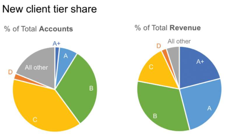

```{r setup, include=FALSE}
knitr::opts_chunk$set(echo = TRUE, message = F, warning = F, fig.align = "center")
# libraries
if (require(pacman) == FALSE) {
  install.packages("pacman")
}
pacman::p_load(tidyverse, scales, lubridate, readxl, 
               kableExtra, knitr, formattable, gridExtra)
```

## CHAPTER 2

### EXERCISE 1 Improve this table

```{r}
ex_1 <- read_excel("../data/storytelling_practice/chapter_2/2.1 EXERCISE.xlsx",
                   col_types = c(
                     "text", "numeric", "numeric","numeric", "numeric"
                     )
                   )

# save and rds file
write_rds(ex_1, "2_1_EX.rds")

# plot the table
kable(ex_1 %>% 
        mutate(
          `% Accounts` = percent(`% Accounts`),
          `Revenue ($M)` = dollar(`Revenue ($M)`),
          `% Revenue` = percent(`% Revenue`)
          )
      ) %>% 
  kable_styling(bootstrap_options = c("responsive","striped"), 
                full_width = F)
```

##### STEP 1: Review the data in Figure 2.1a. What observations can you make? Do you have to make any assumptions when interpreting this data? What questions do you have about this data?

* We should add a *total*. Then we will realize some problems

```{r}
# Find out the actual information
rest <- ex_1 %>%
  summarise_if(is.numeric, sum) %>%
  mutate(Tier = "Rest") %>% 
  select(Tier, everything()) %>% 
  bind_rows(ex_1) %>% 
  filter(Tier == "Rest")

# Create the other missing data 
Other <- tibble(
  Tier = "Other",
  `# of Accounts` = (rest[[2]]*(1 - rest[[3]]))/rest[[3]],
  `% Accounts` = 1 - rest[[3]],
  `Revenue ($M)` = (rest[[4]]*(1 - rest[[5]]))/rest[[5]],
  `% Revenue` = 1 - rest[[5]]
)

# bind the information to add the total 
final_table <- ex_1 %>% 
  bind_rows(Other) %>%
  summarise_if(is.numeric, sum) %>% 
  mutate(Tier = "Total") %>% 
  select(Tier, everything()) %>% 
  bind_rows(ex_1 %>% 
              bind_rows(Other)) %>% 
  mutate(
    Tier = factor(Tier, levels = c("A+","A", "B", "C", "D", "Other", "Total"))
    ) %>% 
  arrange(Tier)
```

It should be a 100% on Accounts and Revenue (%). Something wrong. 

* Round % to only one digit. 
* The number of accounts with a Tier C is the higher one. Is it clearly seen in the column *% Accounts*. 
* The revenue is higher at Tier B, also weel represented on the *% Revenue*. 

##### STEP 2:  Consider the layout of the table in Figure 2.1a. Let’s assume you’ve been told this information must be communicated in a table. Are there any changes you would make to the way the data is presented or the overall manner in which the table is designed?

* I recommend against shading every other row and instead am an advocate for white space (and limited light borders) to set apart columns and rows as needed.

```{r}
final_table %>%
  mutate(
    `% Accounts` = percent(`% Accounts`, digits = 0),
    `Revenue ($M)` = dollar(`Revenue ($M)`),
    `% Revenue` = percent(`% Revenue`, digits = 0)
    ) %>% 
  kable(
    col.names = c("Tier","#", "% OF TOT", "$M", "% OF TOT"), align = "c"
    ) %>% 
  column_spec(5, width = "3cm") %>% 
  column_spec(
    3, border_right = T, extra_css = "border-right: 2px solid;"
    ) %>%
  pack_rows(
    start_row = 7, end_row = 7, hline_before = T, 
    label_row_css = "border-bottom: 2px solid;line-height: 0;padding: 0;"
    ) %>% 
  row_spec(0, bold = T, color = "black", background = "ghostwhite", 
           extra_css = "border-bottom: 2px solid #777777;") %>% 
  column_spec(1, bold = T, color = "black", background = "ghostwhite", 
              extra_css = "border-right: 2px solid #777777;") %>% 
  add_header_above(header = c(" " = 1, "Accounts" = 2, "Revenue" = 2), 
                   bold = T, color = "black", background = "ghostwhite", 
                   extra_css = "border-left: 2px solid #777777;") %>% 
  kable_styling(bootstrap_options = c("responsive", "bordered"), 
                full_width = F)
```

Try to apply a better format. but let's find out a better chart: 

```{r eval=FALSE}
final_table %>% 
  filter(Tier != "Total") %>% 
  mutate(`% Accounts` = color_bar("red")(`% Accounts`)) %>% 
  # start to build the table
  kable(escape = F) %>%
  kable_styling("hover", full_width = F) %>%
  column_spec(5, width = "3cm") %>%
  add_header_above(c(" ", "Hello" = 2, "World" = 2))
```

##### Tranform the data to pie charts

Improve the next chart: 



Create the pie chart: 

```{r}
# add other in the data
all_ex_1 <- ex_1 %>% 
  bind_rows(Other) %>% 
  mutate(
    Tier = factor(Tier, levels = c("Other","D","C", "B", "A","A+"))
    ) 

# plot the pie chart Accounts
pie_accounts <- all_ex_1 %>% 
  ggplot(aes(x = "", y = `% Accounts`, fill = Tier)) +
    geom_col(stat = "identity", width = 1) +
    # Convert to pie (polar coordinates) and add labels
    coord_polar("y", start = 0) + 
    geom_text(
      aes(
        label = Tier#percent(`% Accounts`, digits = 0)
        ), 
      position = position_stack(vjust = 0.7), 
      color = "white", cex = 4.25
      ) + 
    # Add color scale (hex colors)
    scale_fill_manual(
      values=c("#55DDE0", "#33658A", "#2F4858", "#F6AE2D", "#F26419", "#999999")
      ) +
    # Remove labels and add title
    labs(x = NULL, y = NULL, fill = NULL, title = "% Total of Accounts") + 
    # Tidy up the theme
    theme_classic() + 
    theme(axis.line = element_blank(),
          axis.text = element_blank(),
          axis.ticks = element_blank(),
          plot.title = element_text(hjust = 0.5, color = "#666666"), 
          legend.position = "none")

# plot the pie chart Accounts
pie_revenue <- all_ex_1 %>% 
  ggplot(aes(x = "", y = `% Revenue`, fill = Tier)) +
    geom_col(stat = "identity", width = 1) +
    # Convert to pie (polar coordinates) and add labels
    coord_polar("y", start = 0) + 
    geom_text(
      aes(label = Tier), 
      position = position_stack(vjust = 0.7), 
      color = "white", cex = 4.25
      ) + 
    # Add color scale (hex colors)
    scale_fill_manual(
      values=c("#55DDE0", "#33658A", "#2F4858", "#F6AE2D", "#F26419", "#999999")
      ) +
    # Remove labels and add title
    labs(x = NULL, y = NULL, fill = NULL, title = "% Total of Revenue") + 
    # Tidy up the theme
    theme_classic() + 
    theme(axis.line = element_blank(),
          axis.text = element_blank(),
          axis.ticks = element_blank(),
          plot.title = element_text(hjust = 0.5, color = "#666666"), 
          legend.position = "none")

# grid the plots 
grid.arrange(pie_accounts, pie_revenue, nrow = 1)
```

Other ways to improve a pie chart in this stackOverflow [link](https://stackoverflow.com/questions/16184188/ggplot-facet-piechart-placing-text-in-the-middle-of-pie-chart-slices/47645727)

But the best wat to represent that information would be: 

```{r, fig.width=8}
# coord plots for accounts
bar_accounts <- all_ex_1 %>% 
  ggplot(aes(x = Tier, y = `% Accounts`)) +
    geom_col(fill = "dodgerblue4", width = 0.7) + 
    coord_flip() + 
    geom_text(aes(label = if_else(`% Accounts` > 0.05, 
                                  percent(`% Accounts`, digits = 0), NULL)),
              hjust = 1.1, color = "white", size = 4.5) + 
    labs(
      title = expression(paste("TIER |       % OF TOTAL ", bold("ACCOUNTS")))
      ) +
    theme_void() +
    theme(
      plot.title = element_text(hjust = -0.75),
      axis.title.y = element_blank(), 
      axis.text.y = element_text(face = "bold", size = 13),
      axis.title.x = element_blank(),
      axis.text.x = element_blank()
    )

# coord plots for revenue
bar_revenue <- all_ex_1 %>% 
  ggplot(aes(x = Tier, y = `% Revenue`)) +
    geom_col(fill = "dodgerblue4", width = 0.7) + 
    coord_flip() + 
    geom_text(aes(label = if_else(`% Revenue` > 0.05, 
                                  percent(`% Revenue`, digits = 0), NULL)),
              hjust = 1.1, color = "white", size = 4.5) + 
    labs(title = expression(paste("   |       % OF TOTAL ", bold("REVENUE")))) +
    theme_void() +
    theme(
      plot.title = element_text(),
      axis.title.y = element_blank(), 
      axis.text.y = element_blank(),
      axis.title.x = element_blank(),
      axis.text.x = element_blank(), 
      
    )

# merge both chart
grid.arrange(bar_accounts, bar_revenue, nrow = 1)
```

Last step to improve the chart: 

```{r}
# create teh table
pivot_ex_1 <- all_ex_1 %>% 
  select(Tier, `% Accounts`, `% Revenue`) %>% 
  mutate(`% Accounts` = round(`% Accounts`, 2)) %>% 
  pivot_longer(cols = -Tier, names_to = "names", values_to = "perc") 

# define the colors used on the plot
used_colors <- c("#6FB8FF", "dodgerblue4")

# create the plot
pivot_ex_1 %>%
  ggplot(aes(x = Tier, y = perc, fill = names)) +
    geom_col(position = "dodge", width = 0.7) +
    coord_flip() +
    scale_y_continuous(labels = percent_format(accuracy = 1), position = "right") +
    scale_fill_manual(
      values = c("#6FB8FF", "dodgerblue4"), 
      labels = c("% ACCOUNTS","% REVENUE")
      ) +
    labs(
      title = "% OF TOTAL ACCOUNTS vs. REVENUE\n"
      ) +
    theme_void() + 
    theme(
      plot.title = element_text(hjust = 0.5),
      axis.title.y = element_blank(), 
      axis.text.y = element_text(face = "bold", size = 12),
      axis.line.y = element_blank(),
      axis.title.x = element_blank(),
      axis.text.x = element_text(), 
      axis.line.x = element_line(size = 0.5),
      legend.position = "top", 
      legend.justification = "left", 
      legend.title = element_blank(),
      plot.margin = unit(c(1, 4, 1, 1), "lines")
      ) 

```

We can flip that chart: 

```{r}
pivot_ex_1 %>%
  ggplot(aes(x = Tier, y = perc, fill = names)) +
    geom_col(position = "dodge", width = 0.7) +
    scale_y_continuous(labels = percent, position = "left") +
    scale_y_continuous(labels = percent_format(accuracy = 1), position = "left") +
    scale_fill_manual(
      values = c("#6FB8FF", "dodgerblue4"), 
      labels = c("% ACCOUNTS","% REVENUE")
      ) +
    labs(
      title = "% OF TOTAL ACCOUNTS vs. REVENUE\n"
      ) +
    theme_void() + 
    theme(
      plot.title = element_text(hjust = 0.5),
      axis.title.y = element_blank(), 
      axis.text.y = element_text(face = "bold", size = 12),
      axis.line.y = element_line(size = 0.5),
      axis.title.x = element_blank(),
      axis.text.x = element_text(), 
      axis.line.x = element_blank(),
      legend.position = "top", 
      legend.justification = "left", 
      legend.title = element_blank(),
      plot.margin = unit(c(1, 4, 1, 1), "lines")
      ) 
```

Help the user to understand the difference between the different levels:

```{r}
pivot_ex_1 %>%
  ggplot(aes(x = Tier, y = perc, fill = names)) +
    geom_col(position = "dodge", width = 0.7) +
    geom_point(position = "identity") +
    geom_line(aes(group = Tier)) +
    scale_y_continuous(labels = percent_format(accuracy = 1), position = "left") +
    scale_fill_manual(
      values = c("#6FB8FF", "dodgerblue4"), 
      labels = c("% ACCOUNTS","% REVENUE")
      ) +
    labs(
      title = "% OF TOTAL ACCOUNTS vs. REVENUE\n"
      ) +
    theme_void() + 
    theme(
      plot.title = element_text(hjust = 0.5),
      axis.title.y = element_blank(), 
      axis.text.y = element_text(face = "bold", size = 12),
      axis.line.y = element_line(size = 0.5),
      axis.title.x = element_blank(),
      axis.text.x = element_text(), 
      axis.line.x = element_blank(),
      legend.position = "top", 
      legend.justification = "left", 
      legend.title = element_blank(),
      plot.margin = unit(c(1, 4, 1, 1), "lines")
      ) 
```

That would be the same than: 

```{r}
pivot_ex_1 %>%
  ggplot(aes(x = Tier, y = perc, fill = names)) +
    geom_point(position = "identity") +
    geom_line(aes(group = Tier)) +
    scale_y_continuous(labels = percent_format(accuracy = 1), position = "left") +

    scale_fill_manual(
      values = c("#6FB8FF", "dodgerblue4"), 
      labels = c("% ACCOUNTS","% REVENUE")
      ) +
    labs(
      title = "% OF TOTAL ACCOUNTS vs. REVENUE\n"
      ) +
    theme_void() + 
    theme(
      plot.title = element_text(hjust = 0.5),
      axis.title.y = element_blank(), 
      axis.text.y = element_text(face = "bold", size = 12),
      axis.line.y = element_line(size = 0.5),
      axis.title.x = element_blank(),
      axis.text.x = element_text(), 
      axis.line.x = element_blank(),
      legend.position = "top", 
      legend.justification = "left", 
      legend.title = element_blank(),
      plot.margin = unit(c(1, 4, 1, 1), "lines")
      ) 
```

And we can transform that information to:

```{r}
# define palette of colors 
library(RColorBrewer)
my_blues <- brewer.pal(n = 9, "Blues")[4:9]

pivot_ex_1 %>% 
  # pivot_wider(names_from = names, values_from = perc) %>% 
  ggplot(aes(x = names, y = perc, group = Tier, col = Tier)) +
    geom_point() + 
    geom_line() +
    geom_text(aes(label = if_else(
          names == "% Accounts", percent(perc, digits = 0), NULL
          )), hjust = 1.5) +
    geom_text(aes(label = if_else(
          names == "% Revenue", percent(perc, digits = 0), NULL
          )), hjust = -0.5) +
    scale_color_manual(values = my_blues) +
    scale_x_discrete(labels = c("% TOT.\nACCOUNTS", "% TOT.\nREVENUE")) +
    labs(title = "% OF TOTAL ACCOUNTS vs. REVENUE\n") +
    theme_void() + 
    theme(
      plot.title = element_text(hjust = 0.5),
      axis.title.y = element_blank(), 
      axis.text.y = element_blank(),
      axis.title.x = element_blank(),
      axis.text.x = element_text(), 
      axis.line.x = element_blank(),
      legend.position = "right", 
      legend.justification = "left",
      legend.text = element_text(size = 12),
      legend.title = element_blank(),
      plot.margin = unit(c(1, 4, 1, 1), "lines")
      ) 
```

### EXERCISE 2 Improve the table

Let’s look at another table. The following shows the number of meals served each
year as part of a corporate giving program. Spend a moment looking at the data.
What is interesting about it?

```{r}
ex_2 <- read_excel("../data/storytelling_practice/chapter_2/2.2 EXERCISE.xlsx")

# transform to year
library(lubridate)
# ex_2 %>% 
#   mutate(`Campaign Year` = ymd(`Campaign Year`))
```

* In a table we can create a heat map to show how the meals served increase or decrease across the years

But let's do a bar graph: 

```{r}
ex_2 %>% 
  ggplot(aes(x = factor(`Campaign Year`), y = `Meals Served`)) + 
    geom_col(fill = "dodgerblue4", width = 0.7) + 
    theme_void() +
    labs(title = "Meals served over time") +
    xlab(label = "CAMPAIGN YEAR") +
    ylab(label = "# OF MEALS SERVED") +
    scale_y_continuous(labels = scales::number, 
                       breaks = seq(0, max(ex_2$`Meals Served`),50000)) +
    # scale_x_continuous(labels = scales::number_format(accuracy = 1, big.mark = "")) +
    theme(
      axis.title.x = element_text(hjust = 0), 
      axis.title.y = element_text(hjust = 1), 
      axis.text = element_text()
    )
    
```

Now a line chart: 

```{r}
ex_2 %>% 
  ggplot(aes(x = `Campaign Year`, y = `Meals Served`)) + 
    geom_line(color = "dodgerblue4") +
    geom_point(aes(y = if_else(`Campaign Year` == min(`Campaign Year`) |
                         `Campaign Year` == max(`Campaign Year`),
                         `Meals Served`, NULL)), col = "dodgerblue4") +
    geom_text(aes(label = if_else(`Campaign Year` == min(`Campaign Year`), 
                                  number(`Meals Served`, big.mark = ","), NULL)),
              vjust = 1.5, col = "dodgerblue4") +
    geom_text(aes(label = if_else(`Campaign Year` == max(`Campaign Year`), 
                                  number(`Meals Served`, big.mark = ","), NULL)),
              vjust = -1, col = "dodgerblue4") +
    theme_void() +
    labs(title = "Meals served over time", 
         subtitle = "# OF MEALS SERVED") +
    xlab(label = "CAMPAIGN YEAR") +
    ylim(0, max(ex_2$`Meals Served`)) +
    scale_x_continuous(labels = as.character(ex_2$`Campaign Year`), 
                       breaks = ex_2$`Campaign Year`) +
    theme(
      axis.title.x = element_text(hjust = 0),
      axis.text.x = element_text(),
      axis.title.y = element_blank(),
      axis.text.y = element_blank()
    )
```

